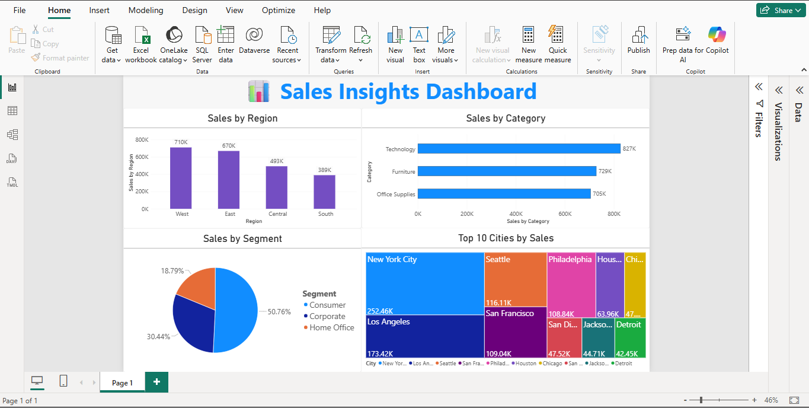

# 📊 Sales Insights Dashboard (Power BI)

This project presents an interactive **Sales Dashboard** built using Power BI to analyze and visualize sales data.

## 🔍 Project Overview

The dashboard helps in understanding:
- Sales performance across regions
- Top-performing product categories
- Customer segment contributions
- Top cities driving revenue

## 📈 Key Insights

- East & South regions show strong sales performance  
- Technology category leads overall sales  
- Home Office segment contributes the highest  
- New York City generates the highest revenue  

## 🛠️ Tools Used

- Power BI  
- Data Visualization Techniques  

## 📷 Dashboard Preview

## 🚀 Purpose

This project demonstrates my ability to:
- Transform raw data into meaningful insights  
- Build interactive dashboards  
- Apply data visualization best practices  

---

💡 Created as part of a Data Analytics learning project.
